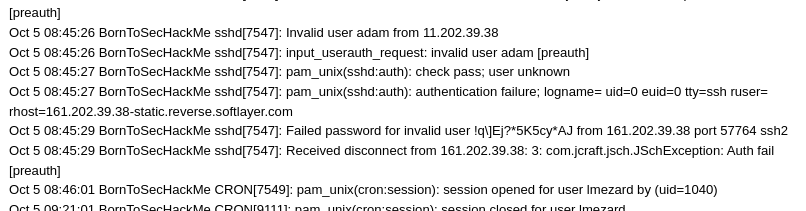
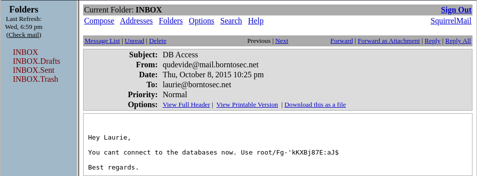
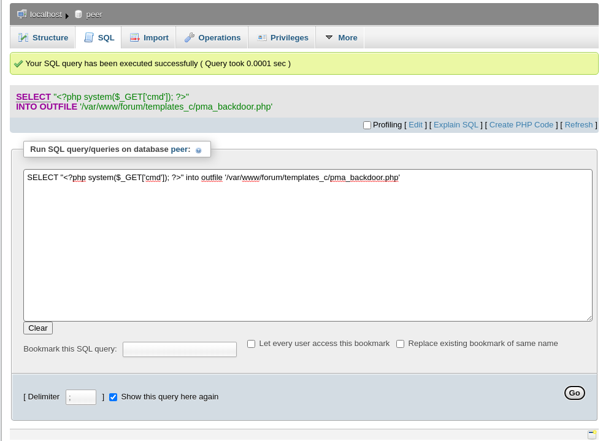
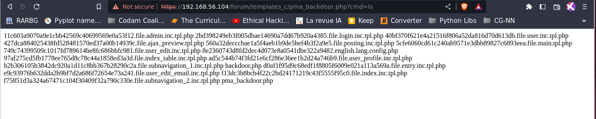

# Web

## Setting up:
Find the address range in VirtualBox: 
File -> Host Network Manager -> Get the IPv4 Address Mask ($ADDRESS_RANGE)

Find the IP of our VM:
`nmap -sP $ADDRESS_RANGE` ($IP_ADDR)

Find the exposed ports and services running them:
`sudo nmap -O $IP_ADDR`
```shell
PORT    STATE SERVICE
21/tcp  open  ftp
22/tcp  open  ssh
80/tcp  open  http
143/tcp open  imap
443/tcp open  https
993/tcp open  imaps
MAC Address: 08:00:27:ED:76:AF (Oracle VirtualBox virtual NIC)
Device type: general purpose
Running: Linux 3.X
OS CPE: cpe:/o:linux:linux_kernel:3
OS details: Linux 3.2 - 3.10, Linux 3.2 - 3.16
```

Use [dirb](https://www.kali.org/tools/dirb/) to find all existing urls on a given domain.
`dirb http://$IP_ADDR`
```
---- Scanning URL: http://192.168.56.104/ ----
+ http://192.168.56.104/cgi-bin/ (CODE:403|SIZE:290)                                 
==> DIRECTORY: http://192.168.56.104/fonts/                                          
+ http://192.168.56.104/forum (CODE:403|SIZE:287)                                    
+ http://192.168.56.104/index.html (CODE:200|SIZE:1025)                              
+ http://192.168.56.104/server-status (CODE:403|SIZE:295) 
```

The index page isn't very interesting, and we don't have permission to access /server-status so let's check out the forum.
The only interesting post here is "Probleme login ?" where a user named lmezard posted an entire logfile, maybe there is something interesting in it?


`Failed password for invalid user !q\]Ej?*5K5cy*AJ`


We can login as lmezard on the forum with this password (USERNAME=lmezard). Now we can see her e-mail on her personal account page.
Running dirb on the https part of the website also shows that /webmail and /phpmyadmin are available.

We can login on the webmail with her e-mail and password and we see an incoming mail with subject "DB Access", hmmmm...


`root/Fg-'kKXBj87E:aJ$`

Login on /phpmyadmin with these credentials.
Going to forum_db => mlf2_userdata we can see all the users and their passwords which appear to be hashed.
mlf stands for [My Little Forum](https://mylittleforum.net/) as we can see at the bottom of the forum page.
The website links to the source code and we can find [the hash function](https://github.com/ilosuna/mylittleforum/blob/0b35c866aede75c2d224b13b0e09297794f0c233/includes/functions.inc.php#L1735)

(Haven't cracked the password)

<!-- https://www.hackingarticles.in/shell-uploading-web-server-phpmyadmin/ -->
<!-- https://www.netspi.com/blog/technical/network-penetration-testing/linux-hacking-case-studies-part-3-phpmyadmin/ -->
Creating a backdoor in phpmyadmin:


